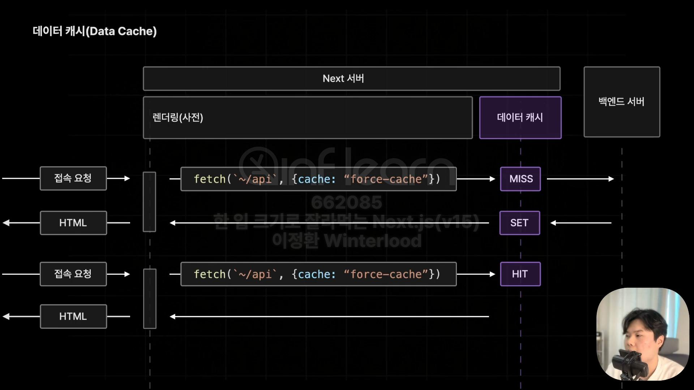

# section04-09 데이터 캐시

## 데이터캐시

- fetch 메서드를 활용해 불러온 데이터를 Next서버에서 보관하는 기능

- 데이터 캐시를 잘 활용하면 한 번 불러온 데이터를 영구적으로 저장해서 향후 불필요한 데이터 패칭의 요청을 방지할 수 있음
- 특정 시간을 주기로 캐싱해둔 데이터를 새롭게 갱신하도록 설정할 수도 있음
- 불필요한 요청수를 줄여서 웹 서비스의 성능을 개선할 수 있음

## 데이터캐시 사용법

- 기본에 사용하고 있던 fetch(Next에서 제공하는 함수) 두번째 인수로 객체 형태의 추가적인 옵션을 설정해서 적용할 수 있음

```tsx
/** 객체 형태의 추가적인 옵션 설정 */

const response = await fetch("~/api", { cache: "force-cache" });
```

## 데이터캐시 옵션

- 데이터 캐시 옵션은 Axios등의 다른 Http리퀘스트 라이브러리에서 활용할 수 없고, Next에서 제공하는 fetch 메서드만 사용해야 함

### 0. 패칭동작 확인하기\_log 확인

- next.config.ts 설정

```ts
import type { NextConfig } from "next";

const nextConfig: NextConfig = {
  logging: {
    fetches: {
      fullUrl: true,
    },
  },
};

export default nextConfig;
```

### 1. cache: "force-cache"



- 요청의 결과를 무조건 캐싱
- 한번 호출 된 이후 다시는 호출되지 않음
  ≒ 캐시된 데이터를 계속 꺼내다씀
- 백엔드 서버에게 요청을 다시 보낼 필요가 없기때문에,
  그냥 그대로 데이터 캐시안에 들어있던 페이지를 생성해 반환함
- .next > cache > fetch-cache 폴더안에 json 형태로 캐시된 데이터가 보관된것을 확인 할수 있음

```tsx
async function AllBooks() {
  const response = await fetch(`${BASE_URL}/book/random`, {
    cache: "force-cache",
  });
  if (!response.ok) {
    return <div>...</div>;
  }
  const recoBooks: Book[] = await response.json();

  return (
    <div>
      {allrecoBooksBooks.map((book) => (
        <BookItem key={book.id} {...book} />
      ))}
    </div>
  );
}

export default function Home() {
  // const allBook = await apiFetch<Book[]>("/book");
  return (
    <section>
      <h3>추천 도서</h3>
      <recoBooks />
    </section>
  );
}
```

### 2. cache: "no-stroe"


- 아무런 cache 설정을 하지않으면 기본값은 no-store
- 패칭의 결과를 절대 저장하지 않음
  ≒캐싱을 아예 하지않도록 설정
- 백엔드 서버에게 데이터를 요청하게 되어 응답받은 데이터로 페이지를 생성하여 브라우저에게 반환하게 됨

* Next v14에서는 기본값이 캐싱되는거였음

```tsx
async function AllBooks() {
  const response = await fetch(`${BASE_URL}/book`, { cache: "no-store" });
  if (!response.ok) {
    return <div>...</div>;
  }
  const allBooks: Book[] = await response.json();

  return (
    <div>
      {allBooks.map((book) => (
        <BookItem key={book.id} {...book} />
      ))}
    </div>
  );
}

export default function Home() {
  // const allBook = await apiFetch<Book[]>("/book");
  return (
    <section>
      <h3>등록된 모든 도서</h3>
      <AllBooks />
    </section>
  );
}
```

### 3. next: {revalidate: 숫자적기 ≓ 초적기}


- ISR 방식처럼 특정시간을 주기로 캐시된 데이터를 업데이트 시켜주는 방식
- 적은 초 시간 주기로 자동으로 Next 서버가 업데이트 함
- 해당 초보다 경과한 경우 요청이 들어왔을때, 일단 캐싱해두었던 페이지 빠르게 보여주고,
  그 이후 요청은 백엔드 서버에게 요청하여 받은 최신 데이터를 캐시로 해서 빠르게 페이지를 생성함

  ```tsx
  const response = await fetch(`${BASE_URL}/book/random`, {
    next: { revalidate: 3 },
  }); // 3초마다 업데이트
  ```

### 4. next: {tags: ['a']}

- 요청이 들어왔을 때에만 데이터를 최신화하도록 설정
- On-Demand ISR 방식 같은 캐싱옵션
- 실습은 서버 액션이나 라우트 핸들러등의 추가적인 개념을 배우고 나서 원활하게 진행 가능해서 이후 섹션에 살펴볼 예정
